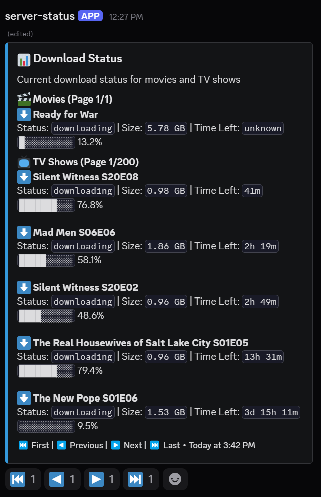

# Discarr - Discord Bot for Radarr & Sonarr Progress Tracking




Discarr is a Discord bot that provides real-time monitoring of Radarr and Sonarr download activities directly in Discord.

## Features

- Real-time download progress tracking for movies and TV shows
- Automatic notifications for download events
- Single, auto-updating status message with pagination
- Modern Discord slash commands
- Easy setup with Docker or local Python

## Prerequisites

- Discord account and bot token
- Radarr and/or Sonarr instances with API access

## Quick Start with Docker

```bash
# Clone the repository
git clone https://github.com/EricBriscoe/discarr.git
cd discarr

# Create config and set environment variables
mkdir -p config
cp .env.example config/.env
# Edit config/.env with your details

# Run with Docker Compose
docker-compose up -d
```

### Docker Run Command

```bash
docker run -d \
  --name discarr \
  --restart unless-stopped \
  -v $(pwd)/config:/app/config \
  -e DISCORD_TOKEN=your_token \
  -e DISCORD_CHANNEL_ID=your_channel_id \
  -e RADARR_URL=http://your-radarr-url:7878 \
  -e RADARR_API_KEY=your_radarr_api_key \
  -e SONARR_URL=http://your-sonarr-url:8989 \
  -e SONARR_API_KEY=your_sonarr_api_key \
  ghcr.io/ericbriscoe/discarr:latest
```

## Local Installation

```bash
# Clone and set up environment
git clone https://github.com/EricBriscoe/discarr.git
cd discarr
python -m venv venv
source venv/bin/activate  # On Windows: venv\Scripts\activate

# Install dependencies
pip install -r requirements.txt

# Configure and run
mkdir -p config
cp .env.example config/.env
# Edit config/.env with your details
python bot.py
```

## Discord Setup

1. Create a bot at [Discord Developer Portal](https://discord.com/developers/applications)
   - Create application → Add bot → Enable Message Content Intent
   - Copy token to `DISCORD_TOKEN` in your config

2. Invite bot to server
   - OAuth2 → URL Generator → Select "bot" and "applications.commands"
   - Required permissions: Send Messages, Read Messages, Manage Messages, Add Reactions
   - Use generated URL to add bot to server

3. Get your channel ID (Enable Developer Mode in Discord settings)
   - Right-click channel → Copy ID → Add to `DISCORD_CHANNEL_ID` in config

## Bot Commands

- `/check` - Manually refresh download status
- `/verbose` - Toggle verbose logging (admin only)
- `/cleanup` - Remove inactive downloads from queue (admin only)

## Troubleshooting

- **Bot not responding**: Verify token and permissions
- **No updates**: Check Radarr/Sonarr URLs and API keys
- **Docker issues**: Check container logs with `docker logs discarr`

## License

Licensed under the MIT License

